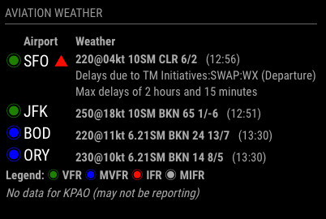

# Module: Aviation Weather (MMM-aviationwx)

This is a module for <a href="https://github.com/MichMich/MagicMirror">MagicMirror</a>.

`MMM-aviationwx` displays aviation weather information (METAR data) for continental U.S. airports on your MagicMirror. If
the FAA tracks delay information for that airport, it will also note if there are any current delays and the reason for the delay if the airport has provided one.

The module includes hyperlinks and tooltips that are generally not accessible with a Raspberry PI installation, but will work if you have mouse control (which is more often the case if you run Magic Mirror on another OS, such as macOS).

## Screenshot



## Installation

1. Navigate to your MagicMirror `modules` directory.
2. Execute `git clone https://github.com/stuloh/MMM-aviationwx`.
3. Add the module to your MagicMirror's `config.js` file (see next section).

## Using the Module

To use this module, add it to the modules array in the `config/config.js` file:

```javascript
modules: [
    ...,
	{
        module: 'MMM-aviationwx',
        header: 'Aviation Weather',
        position: 'top_left',
        config: {
            airports: 'KSFO,PAO,HAF,JFK', // 3-char or 4-char codes, U.S. only
            updateInterval: 10, // update interval in minutes
		}
	},
	...
]
```
### Parameters

* `position`: See MagicMirror <a href="https://github.com/MichMich/MagicMirror#modules">documentation</a> for usage.
* `header`: Optional. See MagicMirror documentation for usage.
* `config.airports`: Comma delimited list of continental U.S. airport codes (no spaces). Supports 3-character FAA codes (which are mostly the same as 3-character IATA codes) or 4-character ICAO codes. 
* `config.updateInterval`: How often the module will pull new data in minutes. Airports generally only update every 60 minutes. Additionally, because of how the <a href="https://aviationweather.gov">Aviation Weather Center</a> provides METAR data, each update pulls down the data for most airports in the continental U.S., so I suggest going easy on the update frequency.

## Notes

* If there is a ceiling, it will show the height in hundreds of feet and whether it's a broken or overcast layer. If there's no ceiling, it will just show the type of highest cloud cover: few, scattered, human-generated clear sky (SKC), automated clear sky (CLR). 
* The time displayed at the end of each weather summary is the time of the last weather report (converted to your local time)
* Hover over weather summary for raw METAR data.
* Click on airport code for TAF data.
* For links and tooltips to work, ensure another module is not 'covering' `MMM-aviationwx` (check your relative `z-index`).
* If there's an airport delay, the module will send a notification to the <a href="https://github.com/MichMich/MagicMirror/tree/develop/modules/default/alert">alert module</a> that is included by default with MagicMirror.

## Potential Improvements / TODOs

* Decoding of wx (`+RA`, `BR`, etc.) to English or icons
* Decoding of delay abbreviations (`VOL`, etc.)
* Support for AK, HI and Canadian airports
* General code and technique clean up

## License

`MMM-aviationwx` is licensed under the Apache License, Version 2.0.